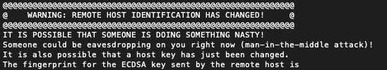

# How to connect a local machine to remote server

Knowing how to access the remote server with your local machine can be really helpful. Suppose that you create a VM on GoogleCloud Platform and you want to write code using your local machine's terminal but have it run on the server, or you want to copy files from server to your local machine, how to do these? You need to create connection between your local machine with the VM first.


# Method 1: Password Login
**First**, you need to configure your VM to permit password login. Open the ssh_config file on your VM with following code:

```
sudo vim /etc/ssh/sshd_config
```

It will open the sshd_config file with vim (a text editor used in UNIX a lot). Modify the **PermitRootLogin** and **PasswordAuthentication** fields to be **yes**. (make sure these two fields are not commented out) It should be as follows:


>**Quick tutor with vim:**

>Press 'i' to enter the INSERT mode and now you can modify the file.

>Press 'esc' to quit INSERT mode and now you are in the nomal mode.

>Type ':x' or ':wq' to save your change and quit.

**Second**, set a password for the root user on your VM with the following code:

```
sudo passwd
```


Enter your password and re-enter it. You will need this password to connect later.

Restart the ssh service using the command:

```
sudo /etc/init.d/ssh restart
```


**Now you can turn to your local machine!** Open the terminal on your local machine. Use the following code to connect with your remote vm:

```
ssh root@[external ip address]
```

>**Notice:** 

>The 'root' should be your VM's user name. If you haven't modified that, it should be 'root' defaultly.

>You can find your VM's external ip address on GoogleCloud Platform.

If you run the command for the first time, it will warn you 'The authenticity of host 'xxx (xxx)' can't be established.' and ask you 'Are you sure you want to continue connecting (yes/no)?'. Type yes and return. It will add the VM to the list of known hosts on your local machine.

Also, this command will pop up a request for your password. Enter the password you set for the root at previous step. Okay now you are all set!

You can notice that now your terminal is run in the VM environment!

If you want to exit the remote VM environment, use Ctrl+D or 'exit' command.


# Method 2: SSH Keys

Using the password login method, you have to enter your password every time, which can be a little annoying. Well, SSH key is here to help!

The general idea is to create public and private key pair on your local machine. And, upload the public key to your vm (remote server). Here are the detailed steps and commands you gonna use:

First, generate the key pair on your local machine:

```
ssh-keygen
```

Running this command will bring up several questions, such as the file in which to save the key and a passphrase. You can either hit Enter all the way to skip them or set them as you would like. After that, you have the key pair on your local machine now! It usually rests in ~/.ssh directory. (You can know the directory during your creating process)

Next step is to upload the public key to your vm. The public key file is the .pub file in the ~/.ssh directory. Use this command to upload:

```
ssh-copy-id -i ~/.ssh/mykey.pub user@host
```

Replace the 'mykey.pub' with your public key file's name. And, the user and root refers to your virtual machine.

This may bring up some authentification process to connect to your vm successfully. For example, if you set password login to your vm before, it may ask you to enter the password. However, after this, you will no longer need to enter password any more!

Now, you are all set. Connect your local machine to the vm by

```
ssh user@host
```

# Troubleshooting

When you connect to the vm by ssh user@host and get the following error:



and it says something like this:

```
Offending ECDSA key in ~/.ssh/known_hosts:12
```

It may due to any possible changes you did to your ssh key or changes on the host. Hopefully, you can solve this problem by:

```
ssh-keygen -R "you server hostname or ip"
```

or delete the 12th host from the known_hosts file as the message pointed out.

Now, it works again!
