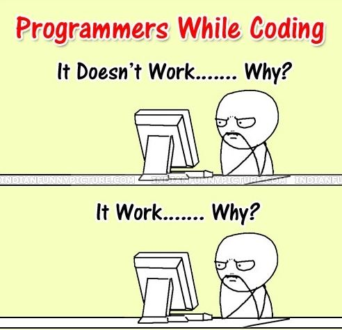

# Notebooks

There are always so many things to learn and tricks to know along the programming way. I try to keep notes and interpret them with clear and simple words. Hope this repository can serve as my own future reference as well as helpful material for anyone stuck in related problems or just want to know more :)

### -[How to connect a local machine to remote server](Connect_To_VM.md)

